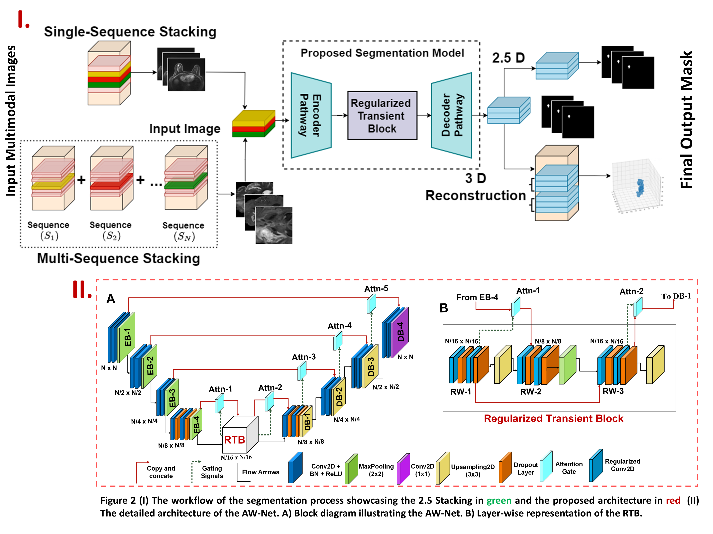

# AW-Net: A Novel Fully Connected Attention-based Medical Image Segmentation Model
This repository contains the official codebase of [AW-Net]( https://openaccess.thecvf.com/content/ICCV2023W/CVAMD/papers/Pal_AW-Net_A_Novel_Fully_Connected_Attention-Based_Medical_Image_Segmentation_Model_ICCVW_2023_paper.pdf) which was accepted in ICCV workshop 2023. AW-Net focuses on segmenting multimodal medical images such as MRI, PET, and CT scan images for multiple organs such as brain, breast, and spine. 


## Overview
A novel fully connected segmentation model which provides a solution to problem of segmenting multi-modal 3D/4D medical images by incorporating a novel regularized transient block. AW-Net uses L1 regularizers followed by dropout layers to improve model performance. The implementation is inspired from ***Attention UW-Net: A fully connected model for automatic segmentation and annotation of chest X-ray***  [Code](https://github.com/Dynamo13/Attention_UWNet) | [Paper]( https://www.sciencedirect.com/science/article/abs/pii/S0010482522007910).

## AW-Net Architecture
<p align="center">

</p>


## Datasets
The datasets used in the paper can be downloaded from the links below:
- [BraTS2020](https://www.med.upenn.edu/cbica/brats2020/data.html)
- [RSNA Cervical Spine 2022](https://www.kaggle.com/competitions/rsna-2022-cervical-spine-fracture-detection)
- [Duke Breast Cancer MRI](https://wiki.cancerimagingarchive.net/pages/viewpage.action?pageId=70226903)
- [QIN Breast](https://wiki.cancerimagingarchive.net/display/Public/QIN-Breast)
  
## Code Implementation

### Environment Setup

The code is developed on tensorflow. In order to run the script file follow the instructions below:
1. Create a new environment using ```python -m /path/to/env```
1. Fork the repository. Move the AW-Net folder to the new environment folder i.e. /path/to/env
1. Use command ```cd /path/to/env/AW-Net``` in the command prompt to access the files
1. There is a [requirement.txt](AW-Net/requirement.txt) file. Run ```pip install -r requirement.txt``` in the command prompt to install the required python packages.

### Network Training
We provide script files to train AW-Net on the [BraTS2020](https://www.med.upenn.edu/cbica/brats2020/data.html) dataset. The [dataloader.py](AW-Net/dataloader.py) works only for images and masks in numpy (.npy) format. The pre-processed version of BraTS2020 dataset can be accesed here [link](https://drive.google.com/drive/folders/1QI2emvmu4o9_WgyIoDkic3m7OVUpvfvT).
The [main.py](AW-Net/main.py) contains script file to run the model. The following steps are required to execute the AW-Net architecture:
- The function expects the path for the directory in which input images are present (arg1)
- The function expects the path for the directory in which input masks are present (arg2)
- The function expects the directory where the weights will be saved after the successful training of the model (arg3)
- The default arguments in the function include num_classes (number of classes present in the mask), val_samples (number of images to be considered as a validation sample during splitting), epochs, and batch_size. Feel free to experiment on these as per the requirement. 
- In order to train the AW-Net model, run
     ```
     cd /path/to/env/AW-Net
     python main.py arg1 arg2 arg3
     ```
   The saved weights will be stored under the path **path/to/env/AW-Net/Data** as .h5 file

  ### Network Prediction
  In order to display the prediction generated by the model for a single image, run the following code snipet:
  ```python
  import numpy as np
  import matplotlib.pyplot as plt
  from model import*
  model=AW_Net((image_height,image_width,image_channel),num_classes, dropout_rate=0.0, batch_norm=True)
  model.compile(optimizer='adam',loss='categorical_crossentropy',metrics=['accuracy'])
  model.load_weights('path/to/env/AW-Net/Data/weights.h5')
  test_image = np.load('path/to/env/AW-Net/Data/Image/0.npy')
  predicted_image=model.predict(test_image.reshape(1,image_height,image_width,image_channel))
  plt.imshow(np.argmax(predicted_image,axis=-1))
  ```
  Set image_height = 128, image_width = 128, image_channel = 3, num_classes = 4 for BraTS2020 data.
  
 ## Citation
 If this code is used for research, please cite our paper:
   ### MLA
   ```
   Pal, Debojyoti, et al. "AW-Net: A Novel Fully Connected Attention-Based Medical Image Segmentation Model." Proceedings of the IEEE/CVF International 
   Conference on Computer Vision. 2023.
   ```
   ### Bibtex
   ```
   @inproceedings{pal2023aw,
   title={AW-Net: A Novel Fully Connected Attention-Based Medical Image Segmentation Model},
   author={Pal, Debojyoti and Meena, Tanushree and Mahapatra, Dwarikanath and Roy, Sudipta},
   booktitle={Proceedings of the IEEE/CVF International Conference on Computer Vision},
   pages={2532--2541},
   year={2023}
   }
   ```
 
